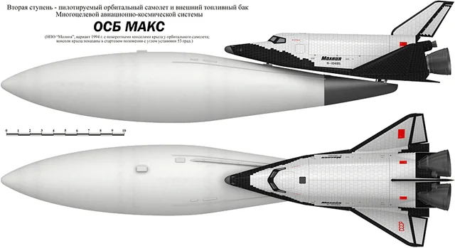

**Full name:** Multipurpose Aerospace System · **Type:** air-launched reusable spacecraft · **Operator:** USSR · **Timeline:** Canon

A Soviet reusable spaceplane launched from the back of an **Antonov An-225**.

## History

- **1981:** proposed after the first An-225 was built, as a very low-cost way to put small payloads into orbit
- **Until the mid-1990s:** the USSR's main transport to Earth-orbiting stations
- **Later:** a variant with integrated fuel tanks was developed into the next-generation Soviet spacecraft

## Design

A variable-geometry, reusable spaceplane mounted on an expendable fuel tank.

## Capacity

- **7 metric tons** of cargo to orbit
- Up to **4 crew**
