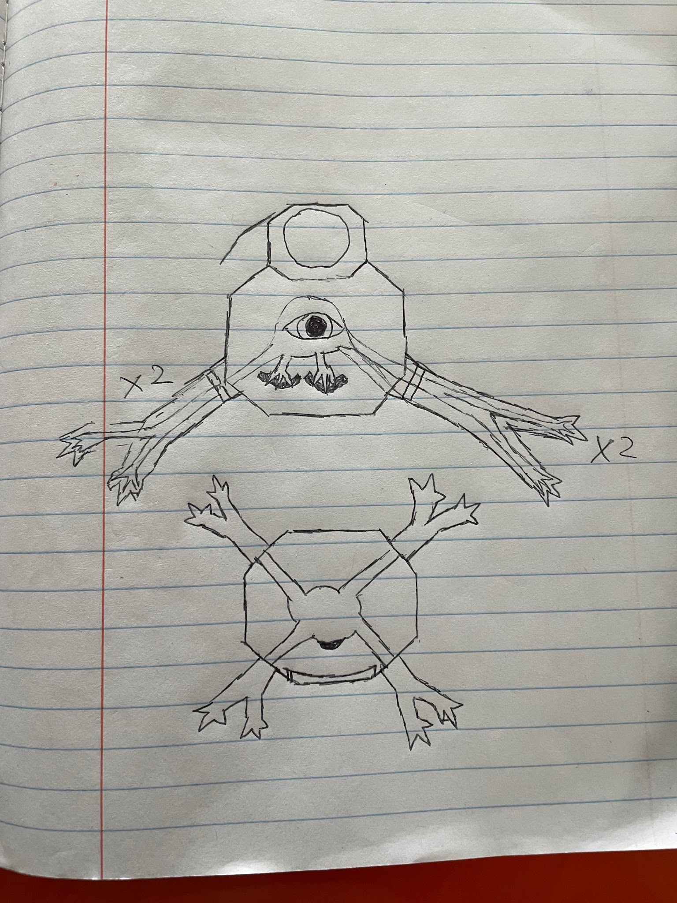

**Used by:** [The Remnants](The-Remnants) · **Timeline:** Canon

A **Shell** is the mechanical body a Remnant lives in. It isn't a shell in the natural sense. It's closer to a personal mech whose job is to protect the fragile Remnant inside and let it interact with the world more powerfully. It is also the Remnant's **home**.

## Inheritance

Shells are passed down through family lines. Each new owner repairs, replaces and rebuilds parts to their own design, so a Shell is always technically the original machine, like the **Ship of Theseus**. A Remnant builds a new Shell when there's none to inherit: when a parent isn't around, has too many children, or dies in their Shell. That became much more common during the war.

## Types

No two Shells are the same, though shared plans and popular technologies make them recognisably Remnant.

| Type | Focus |
|---|---|
| **Combat** | Protection and agility rather than weapons |
| **Livelihood** | Larger and slower, full of amenities. Built to be a *home*, not just to survive in |
| **Looks / function** | Built for a narrow purpose or niche market, or just to look good and show off |

Shells fill the role cars fill for humans, with a market for speed, reliability, looks, and more. Living in one is like living in your car, and a home-focused Shell is like a camper van. Unlike with humans, it's completely normal to sleep in your car.

## Anatomy of a typical Shell

- **Body:** similar to the Remnant itself, with legs altered for balance and added **hands**. Shells are becoming less humanoid over time.
- **Tail:** the creature's short tail becomes a **long power cord**. Shells can make their own power, but plugging into a ship's efficient reactor extends their run time.
- **Interior:** a control centre for the Remnant near the back of the torso, shoulder-joint machinery in the rest of the torso, a generator near the waist, and life-support necessities throughout.
- **Limbs and head:** usually not traversable; packed with machinery.

## Variant: slug-form Shell

Human mechs are modelled on the human body, so this design models itself on the Remnant's. It stretches thin to cool more easily, uses a curved screen for its peripherals, and holds itself in place with four small limbs and matching handlebars.
