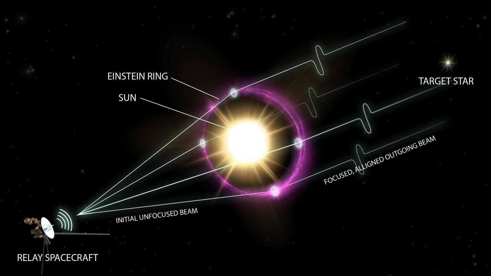

**Type:** deep-space telescope · **Operator:** [Humanity](Humanity) · **Timeline:** Canon

A telescope that uses the **Sun's gravitational field as a lens**. Light from a distant target bends around the Sun and comes to a focus far out in the solar system, where a relay spacecraft collects it. This gives a resolution no conventional telescope can match.

## Role in history

A team stationed to watch the Conglomerate through a solar gravitational lens confirmed that the Conglomerate fleet was moving toward Earth. That sighting began the [Conglomerate War](Conglomerate-War).
