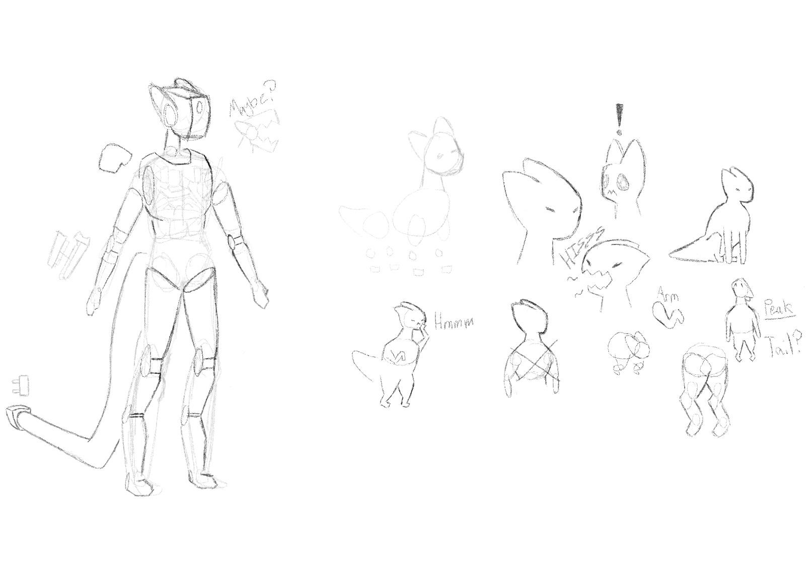
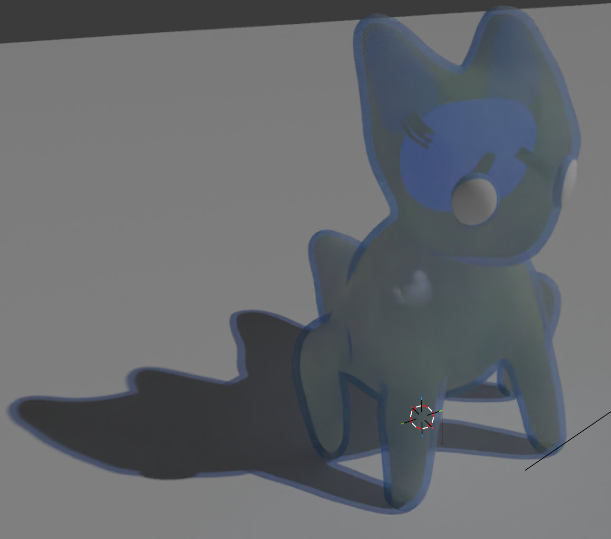

**Also called:** the Remnant · **Population:** ~14 million survivors · **Government:** crowned republic · **Timeline:** Canon

The first alien species humanity meets, and the last survivors of a civilisation destroyed by [the Conglomerate](The-Conglomerate).

## History

The [Remnant homeworld](Remnant-Homeworld) was rich in mineral resources but had poor, lacklustre plant life, which the Remnants improved with devices that later became the [RHHM](RHHM). When the Conglomerate arrived, it judged the Remnants **unfit to join**, and because their planet was so rich, it wiped them out and strip-mined it. The Conglomerate also took the Remnants' older stargate technology.

The escape was a last-ditch effort, not a plan. Priority members of the species were evacuated first: children, scientists, elected officials, and the monarch. Their fleet of several km-scale generation ships (at least four, each carrying around 3.5 million) made an **uncalculated jump** and came out near our solar system. Earth was the closest habitable planet. For what followed, see [First Contact](First-Contact).

## Biology

The Remnant is a **small, very intelligent, physically weak** creature. Most of its body is a malleable substance that absorbs blunt impacts and can attach outside objects to almost any part of the body, most easily the "hands" and feet. Its shape can shift but rarely strays far from its base form.

- **Outer layer:** extremely weak. A piercing or slashing force can make a Remnant **"pop"**, killing it instantly.
- **Limbs:** five appendages: four legs and a stout tail used for balance. The front legs double as arms, and Remnants can walk on two legs.
- **Head:** a flat front face with two front-facing eyes and a mouth, and no nose.
- **Ears:** two thin, very sensitive extensions that detect vibrations in the air.
- **Hands and feet:** no fingers or toes. Their malleable extremities grip surfaces, so Remnants can climb surfaces steeper than 90° if there's texture, even walking upside down on cave roofs.

Because they are so fragile, almost everyone sees Remnants inside their mechanical [Shells](Remnant-Shells).

## Culture

- **Creation above all.** Invention and engineering are the species' defining values, and ownership follows creation: *you own what you make*.
- **Little infighting.** Remnants rarely fight each other, so they never developed advanced weapons. At first contact their weapons were at human level; they understood fission but had never built a bomb.
- **Shells as homes.** A Remnant's Shell is their home, vehicle and heirloom, passed down and rebuilt by each generation like the Ship of Theseus.

## Government

A **crowned republic**. Hereditary royals hold little to no power and act as symbols and representatives. The species has a long history of well-intentioned monarchs, and royals are usually respected. Elected officials run the government, and most of them come from scientific or engineering backgrounds.

- Equal rights and opportunities for everyone, carried by the people more than the government
- **No land ownership.** The only personal property is ships and Shells, owned by whoever built or inherited them. Land and basic resources belong to everyone.
- Materials set aside for a project, or food, count as "claimed", and taking them is stealing. Theft is rare.

The [Remnant Monarch](Remnant-Monarch) and elected officials led the survivors to Earth and addressed the U.N. in 1984.

## Technology

The Remnants have **extremely advanced** non-military technology:

- Interstellar travel through [stargates](Stargates) and jumps through existing wormholes and weak spots in space-time
- Hover and wingless flight (VTOL-like)
- Basic [reflective energy shields](Reflective-Shields)
- [Shells](Remnant-Shells)
- Plant-growth field devices, the ancestor of the [RHHM](RHHM)

## Language

The Remnant learned **English** within weeks of first contact, and English has been the working language between the two species ever since.

## By timeline

| Timeline | Fate |
|---|---|
| [Canon](Timeline-Canon) / [RHV](Timeline-RHV) | Allies of humanity |
| [EACO](Timeline-EACO) | Most stay on Earth and form the core of [the Survivors](The-Survivors) |
| [Red Line](Timeline-Red-Line) | Extinct |
