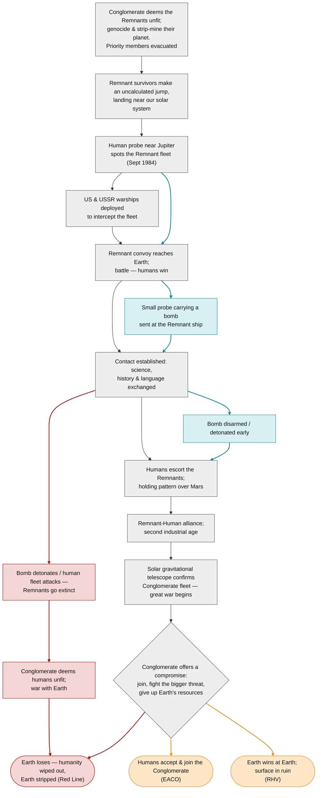

The universe has one **Canon** history up to the Conglomerate's compromise offer, then splits into possible endings. A couple of side-branches split off earlier and either rejoin Canon or end badly.

## Timeline tags

Every story and event is tagged with the timeline it belongs to.

| Tag | Name | What it means | Page |
|---|---|---|---|
| **Canon** | Main timeline | The shared history everyone agrees on (up to the compromise offer). | [Canon Timeline](Timeline-Canon) |
| **I-Line** | Bomb timeline | A bomb is sent after the Remnant fleet and is stopped before it reaches it. **Rejoins Canon**; events before and after it are identical to Canon. | [I-Line](Timeline-I-Line) |
| **RHV** | Remnant-Human Victory | The Remnant-Human alliance refuses the offer and wins the war at Earth. | [RHV Timeline](Timeline-RHV) |
| **EACO** | Earth Accepts Conglomerate Offer | Humanity accepts the offer, joins the Conglomerate and gives up Earth's resources. | [EACO Timeline](Timeline-EACO) |
| **Red Line** | Worst case | Humans destroy the Remnants, then lose to the Conglomerate alone. | [Red Line](Timeline-Red-Line) |
| **N/A** | Unattached | Doesn't depend on any branch (e.g. other star systems). | — |

## Branch map

Grey = Canon · Blue = I-Line · Red = worst case · Orange = possible endings.

## Dated events

The full date-by-date history is on the [Canon Timeline](Timeline-Canon).
